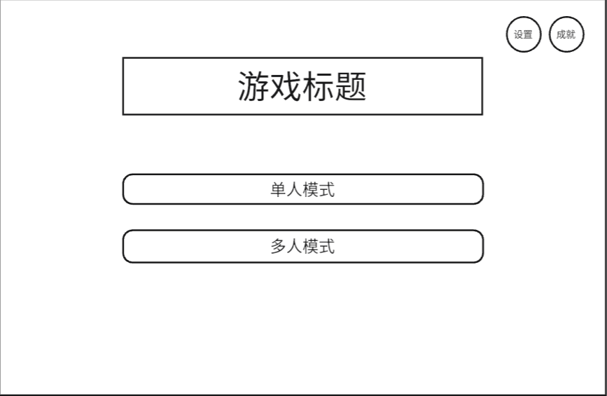
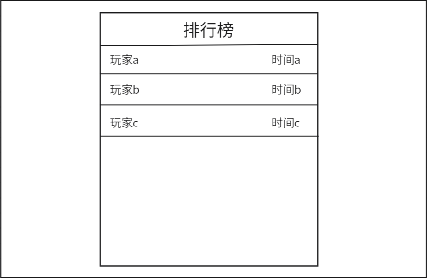
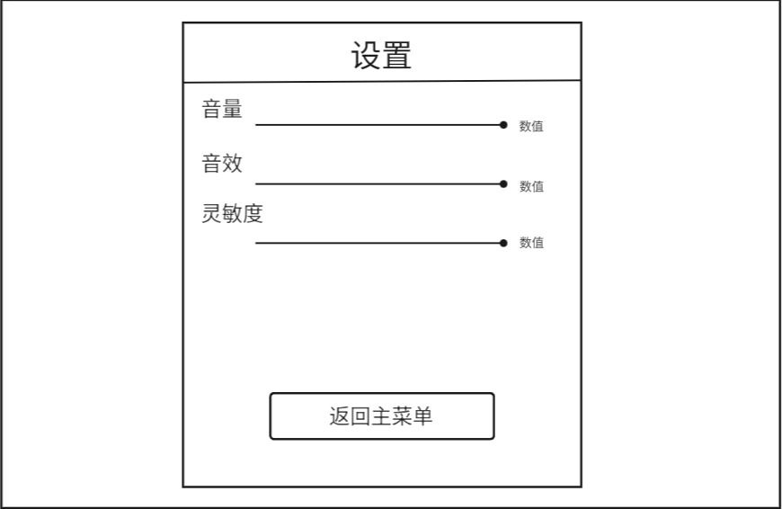
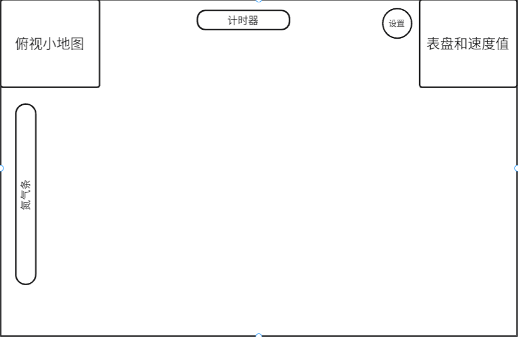
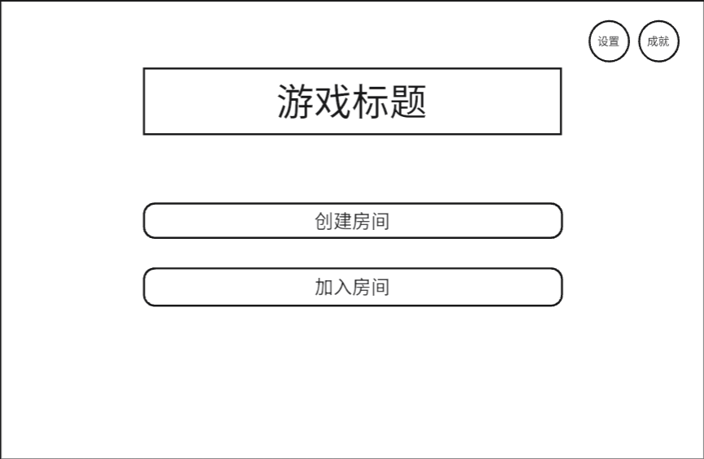
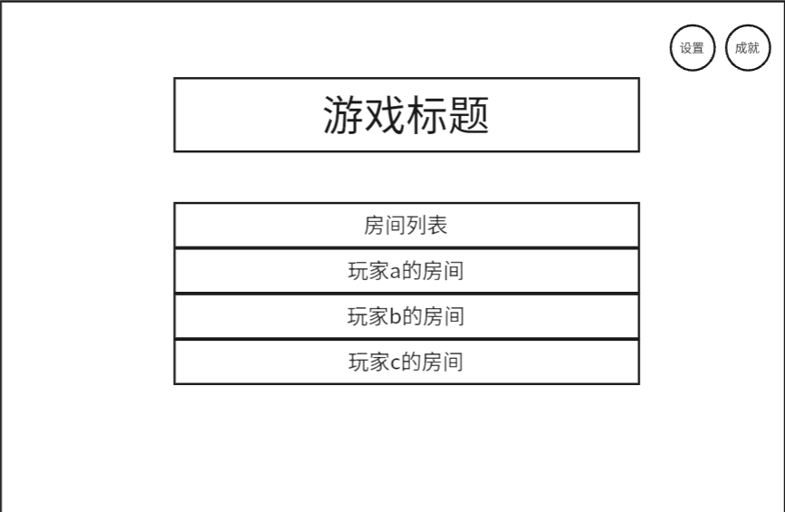
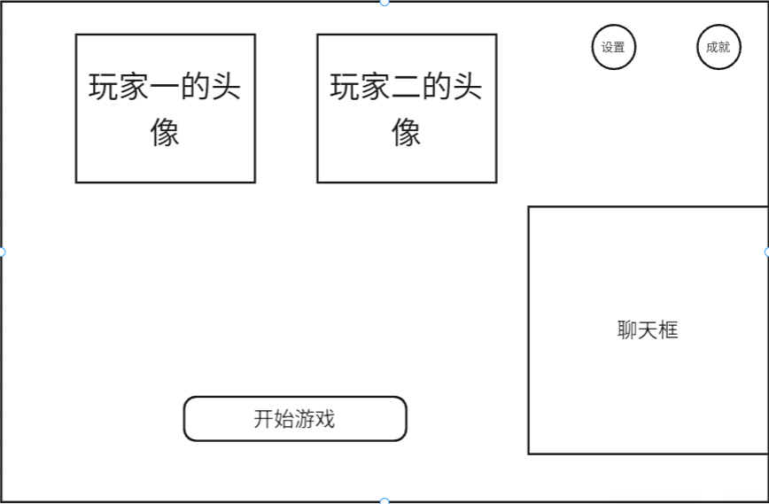

# UI设计文档

## 团队ID：25
## 日期：2025年04月11日

---

### 主要用户界面设计

#### 1. **菜单界面**
- **功能描述**：用户在该界面可以选择游戏模式、进入`设置`或`成就`界面。
- **设计草图/原型**：
  
- **设计说明**：
  - **布局**：游戏标题位于顶部中央，两个游戏模式按钮位于标题下方，设置和成就按钮位于右上角。
  - **元素位置**：
    - **游戏标题**：位于界面顶部中央，采用醒目的字体和适当的大小，确保在各种显示设备上都能清晰可见。
    - **单人模式按钮**：位于游戏标题下方，内部包含“单人模式”文字，便于用户识别和点击。
    - **多人模式按钮**：位于单人模式按钮下方，确保界面的一致性和协调性。
    - **设置按钮**：位于界面右上角，内部包含“设置”文字，便于用户快速访问设置选项。
    - **成就按钮**：位于设置按钮左侧，与设置按钮相邻，内部包含“成就”文字。
  - **交互方式**：
    - 用户可以通过点击**单人模式**或**多人模式**按钮选择相应的游戏模式,**单人模式**直接进入游戏界面，**多人模式**则进入多人模式界面。
    - 用户可以通过点击**设置**按钮进入设置界面，调整游戏设置，如音量、音效、灵敏度等。
    - 用户可以通过点击**成就**按钮查看自己的游戏成就和奖励。
  - **响应式设计**：确保界面在不同设备和屏幕尺寸上都能良好显示，提供一致的用户体验。

#### 2. **成就界面**
- **功能描述**：用户可以在该界面查看自己和其他玩家的最快用时排名。
- **设计草图/原型**：
  
- **设计说明**：
  - **布局**：排行榜标题位于顶部中央，玩家列表位于标题下方。
  - **元素位置**：
    - **排行榜标题**：位于界面顶部中央，采用醒目的字体和适当的大小，确保在各种显示设备上都能清晰可见。
    - **玩家列表**：位于标题下方，以表格形式展示，每行代表一个玩家及其成绩。玩家名称和成绩分别列在表格的两列中，便于玩家快速查看自己的排名和成绩。
  - **交互方式**：
    - 用户可以在排行榜中查看自己的排名和成绩，了解自己在游戏中的表现。
    - 用户可以点击榜单外任意处返回上一界面
  - **响应式设计**：确保界面在不同设备和屏幕尺寸上都能良好显示，提供一致的用户体验。

#### 3. **设置界面**
- **功能描述**：用户可以在此界面调节音量、音效和灵敏度。
- **设计草图/原型**：
  
- **设计说明**：
  - **布局**：设置项垂直排列，便于用户快速找到所需调整的选项。
  - **元素位置**：
    - **标题**：位于界面顶部中央，使用“设置”作为标题，明确标识该界面的功能。
    - **音量调节**：位于标题下方，使用滑动条形式，用户可以通过滑动来调节音量大小。
    - **音效调节**：位于音量调节下方，同样使用滑动条形式，用户可以调节音效的强度。
    - **灵敏度调节**：位于音效调节下方，使用滑动条形式，用户可以根据自己的操作习惯调整灵敏度。
    - **返回主菜单按钮**：位于界面底部，点击该按钮可以回到主菜单界面。
  - **交互方式**：
    - 用户可以通过滑动每个设置项旁边的滑动条来调整相应的参数。
    - 每个滑动条旁边显示当前的数值或状态，提供即时反馈。
    - 用户可以点击榜单外任意处返回上一界面。
    - 用户可以点击**返回主菜单**按钮返回主菜单。

#### 4. **游戏界面**
- **功能描述**：用户可以在该界面进行游戏，可以实时看到左上角小地图与右上角车辆速度，左侧氮气条可以让用户在加速时更有体验感。
- **设计草图/原型**：
  
- **设计说明**：
  - **布局**：将游戏控制和信息展示区域清晰区分，确保用户能够快速获取所需信息并进行操作。
  - **元素位置**：
    - **俯视小地图**：位于界面左上角，提供游戏场景的缩小视图，帮助用户了解当前位置和周围环境。
    - **计时器**：位于界面顶部中央，实时显示游戏时间，便于用户掌握游戏进度。
    - **氮气条**：位于界面左侧，显示当前氮气量，用户可以通过收集氮气并使用氮气加速。
    - **表盘和速度值**：位于界面右上角，显示车辆的速度，帮助用户了解当前行驶速度。
    - **设置按钮**：位于界面右上角，提供快速访问游戏设置的入口。
  - **交互方式**：
    - 用户可以通过收集氮气并点击氮气条来加速，提升游戏体验。
    - 用户可以点击设置按钮进入设置界面，调整游戏设置，可以通过设置界面返回主菜单，退出当前游戏。

#### 5. **多人模式界面**
- **功能描述**：用户可以选择创建房间和加入房间，以便与朋友或其他玩家一起进行游戏。
- **设计草图/原型**：
  
- **设计说明**：
  - **布局**：游戏标题位于顶部中央，操作按钮位于标题下方，设置和成就按钮位于右上角。
  - **元素位置**：
    - **游戏标题**：位于界面顶部中央，使用醒目的字体和适当的大小，确保在各种显示设备上都能清晰可见。
    - **创建房间按钮**：位于游戏标题下方，内部包含“创建房间”文字，便于用户识别和点击。
    - **加入房间按钮**：位于创建房间按钮下方，内部包含“加入房间”文字。
    - **设置按钮**：位于界面右上角，内部包含“设置”文字，便于用户快速访问设置选项。
    - **成就按钮**：位于设置按钮左侧，与设置按钮相邻，内部包含“成就”文字。
  - **交互方式**：
    - 用户可以通过点击**创建房间**按钮来创建一个新的游戏房间，等待其他玩家加入。
    - 用户可以通过点击**加入房间**按钮来加入已有的游戏房间，与其他玩家一起游戏。
    - 用户可以通过点击**设置**按钮进入设置界面。
    - 用户可以通过点击**成就**按钮进入成就界面。

#### 6. **房间列表界面**
- **功能描述**：用户可以看到所有已创建的房间，并选择加入。
- **设计草图/原型**：
  
- **设计说明**：
  - **布局**：游戏标题位于顶部中央，房间列表位于标题下方，设置和成就按钮位于右上角。
  - **元素位置**：
    - **游戏标题**：位于界面顶部中央，使用醒目的字体和适当的大小，确保在各种显示设备上都能清晰可见。
    - **房间列表**：位于游戏标题下方，以列表形式展示所有已创建的房间。每个房间项显示房间名称和创建者。
    - **设置按钮**：位于界面右上角，内部包含“设置”文字，便于用户快速访问设置选项。
    - **成就按钮**：位于设置按钮左侧，与设置按钮相邻，内部包含“成就”文字。
  - **交互方式**：
    - 用户可以通过点击房间列表中的某个房间项来加入该房间，开始游戏。
    - 用户可以通过点击**设置**按钮进入设置界面。
    - 用户可以通过点击**成就**按钮进入成就界面。

#### 6. **等待大厅界面**
- **功能描述**：用户创建房间后可以在此等待其他玩家加入，并可以与进入房间的玩家聊天。房间主可以决定何时开始游戏。
- **设计草图/原型**：
  
- **设计说明**：
  - **布局**：将玩家信息、聊天区域和操作按钮清晰区分，确保用户能够快速获取所需信息并进行操作。
  - **元素位置**：
    - **玩家头像**：位于界面顶部，显示当前房间内玩家的头像和昵称，便于识别，每有一位玩家加入就多一个头像框，最多4个。
    - **聊天框**：位于界面右侧，提供玩家之间的实时聊天功能，增强互动性。
    - **开始游戏按钮**：位于界面底部中央，房间主可以点击此按钮开始游戏。
    - **设置按钮**：位于界面右上角，内部包含“设置”文字，便于用户快速访问设置选项。
    - **成就按钮**：位于设置按钮左侧，与设置按钮相邻，内部包含“成就”文字。
  - **交互方式**：
    - 用户可以在聊天框中输入文字并发送，与其他玩家进行实时聊天。
    - 房间主可以通过点击**开始游戏**按钮来启动游戏，所有玩家将进入游戏场景。
    - 用户可以通过点击**设置**按钮进入设置界面。
    - 用户可以通过点击**成就**按钮进入成就界面。