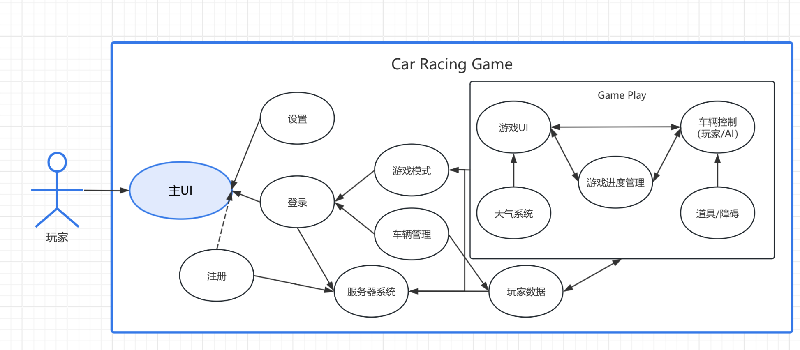

# 赛车游戏架构设计说明

## 一、主系统功能模块
### 1. 用户界面(UI)
- **主UI**：游戏主界面，包含入口按钮和导航功能  
- **设置**：音效、画质、控制等游戏参数配置  
- **登录/注册**：玩家账号系统，支持注册新账号和登录验证  

### 2. 核心功能
- **游戏模式**：提供不同比赛模式选择（如计时赛、对战赛等）  
- **车辆管理**：车辆选择、改装及性能调整系统  
- **服务器系统**：多人在线对战服务支持  
- **玩家数据**：存储和显示玩家成就、等级等信息  

---

## 二、游戏进行时功能模块
### 1. 动态系统
- **天气系统**：实时天气变化影响驾驶体验（雨雪/昼夜效果）  
- **游戏进度管理**：比赛计时、圈数记录、排名更新  

### 2. 控制与交互
- **车辆控制**  
  - 玩家控制：按键操作  
  - AI控制：自动驾驶算法（NPC车辆）  
- **道具/障碍**：赛道上的增益道具或障碍物交互  

### 3. 实时界面
- **游戏UI**：比赛中显示的HUD（速度表、地图、道具栏等）  

---

## 三、数据管理
- **玩家数据同步**：实时更新比赛成绩、车辆等数据到主系统  